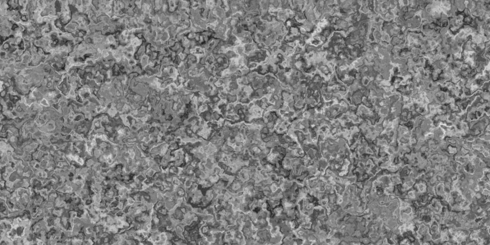

 # Quick-Noise

Quick-Noise is a high-performance SIMD-accelerated batched noise generation library,
with world-class performance in uniform grid noise generation on the CPU.
It runs on Stable Rust.

# Usage

Quick-Noise offers two public facing interfaces. The first is grid noise.
The performance of grid noise is often magnitudes higher than batch noise, and is the recommended way to create noise for high-performance procedural generation.
Grid noise samples a squared (2D) or cubed (3D) region uniformly.
Quick-Noise also supports batch noise, which samples points at any arbitrary input.

Node: For comprehensive details, check the documentation.

## Builders

Builders are used to offer extensive options while remaining approachable.
Every builder can be executed with one of four methods: `build()`, `fill()`, `fill_onto()`, and `into_iter()`.
- `build()`: returns an array of the noise result directly
- `fill()`: fills an array that you provide, potentially saving costly memory copies
- `fill_onto`: adds the result to an array you provide, allowing you to do certain operations in-place
- `into_iter()`: returns an iterator containing simd registers

Iterators allow multiple steps of the noise pipeline to fuse together, providing speedups by keeping data in registers directly.
Note that grid noise is an exception to this rule, but makes up for it many times over in speed.

All builders must have their dimensions and sizes specified at compile time.
The current implementation uses a stack-only approach for maximum performance,
but a heap-based alternative is in progress for larger dimensions and dimensions determined at runtime.

## Grid Noise

Grid noise is called through a grid region. Each noise call takes into account both the grid seed and the seed of the noise call,
making it easier to have multiple noise maps with the same primary seed. Note that desipte specifying the dimensions explicitly,
the total area (2D) or volume (3D) is necessary due to limitations with const generic expressions on Stable Rust.

```rs
use quick_noise::{Grid2D, Perlin};

// Creates an anchor into a region of sample space.
let grid_2d = Grid2D::<500, 500, 250000>::new()
	.position(0, 0)
	.seed(102);
	
let grid_2d.fbm::<Perlin>()
	.octaves(6)
	.frequency(0.01)
	.into_iter()
	.to_grayscale_image::<500, 500>("noise_images/perlin_batch_2d.png");
	
// FBM Grid noise with all parameters.
let noise = grid_2d.fbm::<Perlin>()
	.seed(0)
	.octaves(1)
	.frequency(0.03125)
	.lacunarity(2.0)
	.persistence(0.5)
	.amplitude(1.0)
	.normalization(true)
	.scaling(1.0, 1.0)
	.build();
```

Currently, only Perlin is supported for grid noise. For octave sequences more complicated than FBM noise,
`custom` can be used for granular control over frequencies and weights.

```rs
use quick_noise::{Grid2D, Perlin};

// Custom list of octaves that can't be easily described by FBM noise.
let octave_list = vec![
	// Creates octaves from frequency and weight.
	Octave2D::splat(0.05, 7.0),
	Octave2D::splat(0.02, 4.0),
	Octave2D::splat(0.03, 15.0),
	Octave2D::splat(0.04, 9.0),
	Octave2D::splat(0.05, 15.0),

	// Allows axis-specific granularity for frequency.
	// This creates 'stretched' noise.
	Octave2D::new(Vec2::new(0.01, 0.015), 50.0),
];

// Takes in a slice reference for flexible array or heap usage.
let noise = grid_2d.custom::<Perlin>(octave_list.as_slice())
	.seed(1000)
	.amplitude(2.0)
	.build();
```

Quick-Noise makes FBM warped noise convenient through a dedicated grid method.
It internally adds the values of the grid to the offset iterators you provide it.
This can be chained together for complex warp configurations. Since it uses batch noise,
Perlin, Value, Simplex, and Cellular can all be used here.

```rs
use quick_noise::{Grid2D, Perlin};

let grid_2d = Grid2D::<500, 300, 150000>::new();

// Create noise offsets to warp by with fast grid noise.
let noise1 = grid_2d.fbm::<Perlin>().octaves(6).seed(0).into_iter();
let noise2 = grid_2d.fbm::<Perlin>().octaves(6).seed(1).into_iter();

grid_2d
	.warp::<Perlin>(noise1, noise2)
	.octaves(1) // Cheap single octave for expensive batch noise call.
	.strength(100.0)
	.into_iter()
	.to_grayscale_image::<500, 300>("noise_images/perlin_warp_2d.png");
```



## Batch Noise

Batch noise operates directly on static methods and takes iterators as inputs. Perlin, Value, Simplex, and Cellular all support Batch noise.

```rs
use quick_noise::{Grid2D, Batch2D, Simplex};

// Use grid for generating iters.
let grid_2d = Grid2D::<32, 32, 1024>::new().position(0, 0);

let noise = Batch2D::<Simplex, 1024>(grid_2d.x_iter(), grid_2d.y_iter())
	.octaves(6)
	.frequency(0.2)
	.lacunarity(0.4)
	.persistence(0.6)
	.scaling(1.0, 0.5, 1.0)
	.build();
```

Batch noise allows for arbitrary input coordinates, enabling techniques such as domain warping.
In this example, a uniform grid is being generated manually for demonstration purposes. Using grid noise is much faster for this use case.
Batch noise also supports custom octaves.

## Simd

Quick-Noise uses a custom simd module purpose-built for noise. Unlike std::simd, it works on stable.
However, only SSE, AVX2, AVX512, and NEON are supported currently. For other systems, a scalar fallback exists,
but the performance is much worse. Luckily the vast majority of computers used today support one of these instruction sets.

This simd module can support most basic operations, and can be used directly to benefit from it:

```rs
use quick_noise::{Grid2D, Perlin};
use quick_noise::simd::{ArchSimd};
use std::iter::zip;

let grid_2d = Grid2D::<1024, 1024, 1048576>::new().position(0, 0);

let iter_1 = grid_2d.fbm::<Perlin>().seed(1).octaves(6).into_iter();
let iter_2 = grid_2d.fbm::<Perlin>().seed(2).octaves(6).into_iter();

let iter_3 = zip(iter_1, iter_2).map(|(x, y)| x * y);
```

Using these iterators can fuse operations and avoid multiple vertical passes, particularly for batch noise.
`ArchSimd` represents a raw simd register for a given architecture. Unlike std::simd which abstracts these architecture details,
this simd module offers you the ability to explicitly control loops that work best for your CPU.

# Performance

## Grid Noise

Grid noise shares computations across samples to achieve greater performance.
As a result, lower frequencies have greater performance than higher frequencies.
Additionally, the dimensions of noise call impact performance as well. Array sizes
that are multiples of 16 offer the best SIMD usage. When sizes get very large, memory 
transfer and cache intermediaries becomes more expensive. For maximum performance, 32x32 and 64x64
is recommended. However, it is better to use larger calls directly than to transfer
memory from smaller calls onto a larger noise map.

Results are measured in billions of points per second single-threaded for one noise pass
over a 32x32 size.
- AVX2: I7-13700H | XPS 15 9530 Laptop | Linux
- AVX512: Ryzen 7 9800X3D | Linux

| Frequency | 2D Perlin AVX2 | 3D Perlin AVX2 | 2D Perlin AVX512 | 3D Perlin AVX512 |
|-----------|----------------|----------------|------------------|------------------|
| 1 / 64    | 10.3 B/s       | 13.5 B/s       | 17.6 B/s         | 51.0 B/s         |
| 1 / 48    | 9.23 B/s       | 12.7 B/s       | 15.4 B/s         | 42.5 B/s         |
| 1 / 32    | 10.3 B/s       | 13.5 B/s       | 17.6 B/s         | 51.0 B/s         |
| 1 / 24    | 8.03 B/s       | 11.4 B/s       | 12.8 B/s         | 32.7 B/s         |
| 1 / 16    | 8.12 B/s       | 11.9 B/s       | 14.2 B/s         | 33.3 B/s         |
| 1 / 8     | 5.48 B/s       | 8.22 B/s       | 8.74 B/s         | 20.9 B/s         |
| 1 / 4     | 2.82 B/s       | 3.20 B/s       | 4.73 B/s         | 5.42 B/s         |


## Batch Noise

Batch noise processing is much more flexible than uniform grid, allowing for any arbitrary input and enabling
techniques such as domain warping. Results are measured in millions of points per second. Performance is still WIP.

|   Perlin    | 2D AVX2 | 3D AVX2 |
|-------------|---------|---------|
| Quick-Noise | 980 M/s | 304 M/s |
| FastNoise2  | 509 M/s | 224 M/s |

|   Simplex   | 2D AVX2 | 3D AVX2 |
|-------------|---------|---------|
| Quick-Noise | 638 M/s | 298 M/s |
| FastNoise2  | 425 M/s | 241 M/s |

|    Value    | 2D AVX2   | 3D AVX2 |
|-------------|-----------|---------|
| Quick-Noise | 1,080 M/s | 619 M/s |
| FastNoise2  | 704 M/s   | 419 M/s |

|   Cellular  | 2D AVX2 | 3D AVX2  |
|-------------|---------|----------|
| Quick-Noise | 570 M/s | 101 M/s  |
| FastNoise2  | 156 M/s | 46.5 M/s |

# Running

Height maps can be generated in `examples/basic.rs`. To run these examples, use:

```
cargo run --example basic --release
```

It is important that `RUSTFLAGS='-C target-cpu=native'` and `--release` is used for the best performance.
`target-cpu=native` is specified by default in this project, but if you use it in your project use other flags
you may achieve worse performance.

Criterion benches can be run with:

```
cargo bench
```

Simd module tests can be run with:

```
cargo test
```
