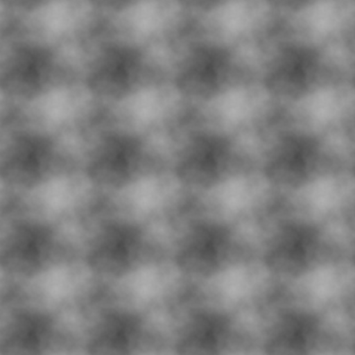

High performance SIMD procedural noise library for batch and uniform grid sampling. Works on stable Rust.

# Performance

### 2D Noise
Time taken to produce 3 octaves of FBM noise for 1024x1024 (1,048,576) samples.
| Library              | Perlin  | Value   | Simplex | Cellular |
|----------------------|---------|---------|---------|----------|
| quick-noise (grid)   | 0.66 ms | 0.50 ms |    X    |    X     |
| quick-noise (batch)  | 4.19 ms | 3.79 ms | 5.84 ms | 7.03 ms  |
| fastnoise2           | 6.22 ms | 5.01 ms | 7.33 ms | 21.4 ms  |
| simd-noise           | 9.70 ms |    X    |    X    | 14.0 ms  |
| noise-rs             | 30.1 ms | 29.2 ms | 49.4 ms | 96.3 ms  |
| noiz                 | 31.4 ms | 26.3 ms | 44.9 ms | 92.6 ms  |
| libnoise             | 87.8 ms | 27.9 ms | 117 ms  | 176 ms   |

### 3D Noise
Time taken to produce 3 octaves of FBM noise for 128x128x128 (2,097,152) samples.
| Library              | Perlin  | Value   | Simplex | Cellular |
|----------------------|---------|---------|---------|----------|
| quick-noise (grid)   | 0.87 ms | 0.62 ms |    X    |    X     |
| quick-noise (batch)  | 27.2 ms | 12.0 ms | 24.1 ms | 43.4 ms  |
| fastnoise2           | 29.7 ms | 16.0 ms | 37.9 ms | 137 ms   |
| simd-noise           | 35.7 ms |    X    |    X    | 96.3 ms  |
| noise-rs             | 92.0 ms | 212 ms  | 251 ms  | 460 ms   |
| noiz                 | 127 ms  | 107 ms  | 163 ms  | 489 ms   |
| libnoise             | 232 ms  | 90.0 ms | 250 ms  | 919 ms   |

* X signifies the noise type is not supported or readily exposed
* Grid path performance degrades for very high frequencies, and cannot support
frequencies >= 1.0. Grid noise. However, it can generate 10+ billion samples per second
at smaller grid sizes (64x64, 32x32x32) where memory transfer is a smaller barrier.
More detailed benchmarks below.


# Usage

quick-noise offers two public facing interfaces. The first is grid noise.
The performance of grid noise is often magnitudes higher than the second interface,
batch noise, and the recommended path for high-performance procedural generation.
Grid noise samples a squared (2D) or cubed (3D) region uniformly while batch noise 
samples points at arbitrary inputs.

## Builders

Builders are used to offer extensive options while remaining approachable.
Every builder can be executed with one of three methods: `build()`, `fill()`, and `into_iter()`.
- `build()`: returns a new Vec of the noise result directly
- `fill()`: fills a slice that you provide, potentially saving costly memory copies
- `into_iter()`: returns an iterator containing simd registers of the output

Iterators allow multiple steps of the noise pipeline to fuse together, providing speedups by keeping data in registers directly.
Note that grid noise is an exception to this rule, but makes up for it many times over in speed.


## Combiners and Generators

Generators are structs that define how to generate noise. This includes `Perlin`, `Value`, `Simplex`, and `Cellular`.
Combiners specify *how* that noise is applied across multiple octaves (noise passes). This includes
`Fbm`, `Billow`, `Ridged`, `Multi`, `HybridMulti`, `Terrace`, and `PingPong`. Combiners apply to both batch and grid noise.

## Grid Noise

Grid noise is called through a grid region. Each noise call takes into account both the grid seed and the seed of the noise call,
making it easier to have multiple noise maps with the same primary seed.

```rs
use quick_noise::{Grid, Fbm, Perlin};

// Creates an anchor into a region of sample space.
let grid = Grid::<2>::new(200, 200) // Specify a 2D 200x200 grid.
	.grid_position(0, 0)
	.seed(102);
	
grid.builder::<Fbm, Perlin>()
	.octaves(6)
	.frequency(0.01)
	.into_iter()
	.to_grayscale_image(200, 200, "noise_images/perlin_batch_2d.png");
	
// FBM Grid noise with all parameters.
let noise = grid.builder::<Fbm, Perlin>()
	.seed(0)
	.octaves(1)
	.frequency(0.03125)
	.lacunarity(2.0)
	.persistence(0.5)
	.amplitude(1.0)
	.normalization(true)
	.scaling(1.0, 1.0)
    .initialization(true) // Setting to false adds noise to current values.
    .finalization(true) // Some combiners have a finalization stage.
	.build();
```

Currently, only Perlin and Value is supported for grid noise. For octave sequences more complicated than FBM noise,
`builder_with_octaves` can be used for granular control over frequencies and weights.

```rs
use quick_noise::{Grid, Billow, Value};

let grid = Grid::<2>::new(200, 200);

// Custom list of octaves that can't be easily described by FBM noise.
let octave_list = [
	// Creates octaves from frequency and weight.
	Octave::<2>::splat(0.05, 7.0),
	Octave::<2>::splat(0.02, 4.0),
	Octave::<2>::splat(0.03, 15.0),
	Octave::<2>::splat(0.04, 9.0),
	Octave::<2>::splat(0.05, 15.0),

	// Allows axis-specific granularity for frequency.
	// This creates 'stretched' noise.
	Octave::<2>::new([0.01, 0.015], 50.0),
];

let mut result = vec![0.0; 40000];
let noise = grid.builder_with_octaves::<Billow, Value>(octave_list.as_slice())
	.seed(1000)
	.amplitude(2.0)
	.fill(result.as_mut_slice());
```

quick-noise makes FBM warped noise convenient through a dedicated grid method.
It internally adds the values of the grid to the offset iterators you provide it.
This can be chained together for complex warp configurations. Since it uses batch noise,
Perlin, Value, Simplex, and Cellular can all be used here.

```rs
use quick_noise::{Grid, Fbm, Perlin};

let grid = Grid::<2>::new(1024, 512);

// Create noise offsets to warp by with fast grid noise.
let noise1 = grid.builder::<Fbm, Perlin>().octaves(6).seed(0).into_iter();
let noise2 = grid.builder::<Fbm, Perlin>().octaves(6).seed(1).into_iter();

grid.warp_builder::<Fbm, Perlin>(100.0, noise1, noise2)
    .octaves(2) // Cheap two octaves for expensive batch noise call.
    .frequency(1. / 32.0)
    .into_iter()
    .to_grayscale_image(1024, 512, "noise_images/perlin_warp_2d.png");

```


You can also set custom tiling parameters to the grid to generate noise that
wraps around and repeats. Unlike other methods, this method does not
require a higher dimension and operates natively in that algorithm.
However, frequencies must align with the given tiling. For example,
a frequency of `1 / 1000` would not work with a tiling of `(2048, 2048)`.
Frequencies of `1 / 1024` and `1 / 512` would. Tiling is only supported
for grid_noise currently.

You can choose to only enable tiling for specific axes and can specify the
size of the tiles for each axis specifically.

```rs
use quick_noise::{Grid, Fbm, Perlin};

let grid = Grid::<2>::new(1024, 1024)
	.grid_position(0, 0)
	.seed(100)
	.tiling(Some(128), Some(128)); // Put None to disable tiling for that axis.

grid.builder::<Fbm, Perlin>()
	.octaves(6)
	.frequency(1.0 / 128.0)
	.into_iter()
	.to_grayscale_image(1024, 1024, "noise_images/perlin_tiles.png");
```



## Batch Noise

Batch noise operates directly on static methods and takes iterators as inputs. Perlin, Value, Simplex, and Cellular all support Batch noise.

```rs
use quick_noise::{BatchNoise, Fbm, Simplex};

// Use grid for generating iters.
let grid = Grid::<2>::new(100, 100).grid_position(0, 0);

let noise = BatchNoise::<2, Fbm, Simplex>::builder(grid.x_iter(), grid.y_iter())
	.octaves(6)
	.frequency(0.2)
	.lacunarity(0.4)
	.persistence(0.6)
	.scaling(1.0, 0.5)
	.build();
```

Batch noise allows for arbitrary input coordinates, enabling techniques such as domain warping.
In this example, a uniform grid is being generated manually for demonstration purposes. Using grid noise is much faster for this use case.
Since simplex and cellular do not currently support grid noise, this method can be used to generate
them on a grid. Batch noise also supports custom octaves.

## Feature Flags

quick-noise offers a couple of utility features. These are disabled by default to keep compilation lean.

### image
The image feature flag uses the `image` crate and enables the usage of `to_grayscale_image` for generating
grayscale images of your noise.

### serde
The serde feature flag dervies `Serialize` and `Deserialize` for config structs.

## Simd

quick-noise uses a custom simd module purpose-built for noise. Unlike std::simd, it works on stable.
However, only SSE, AVX2, AVX512, and NEON are supported currently. For other systems, a scalar fallback exists,
but the performance is much worse. Luckily the vast majority of computers used today support one of these instruction sets.

This simd module can support most basic operations, and can be used directly to benefit from it:

```rs
use quick_noise::{BatchNoise, Ridged, Cellular};
use quick_noise::simd::ArchSimd;
use std::iter::zip;

let grid = Grid::<2>::new(128, 128).grid_position(0, 0);

let iter_1 = BatchNoise::<2, Ridged, Cellular>::builder(grid.x_iter(), grid.y_iter())
    .seed(0)
    .into_iter();

let iter_2 = BatchNoise::<2, Ridged, Cellular>::builder(grid.x_iter(), grid.y_iter())
    .seed(1)
    .into_iter();

let iter_3 = zip(iter_1, iter_2).map(|(x, y)| x * y);
```

Using these iterators can fuse operations and avoid multiple vertical passes, particularly for batch noise.
`ArchSimd` represents a raw simd register for a given architecture. Unlike std::simd which abstracts these architecture details,
this simd module offers you the ability to explicitly control loops that work best for your CPU.

`simd_iter` and `simd_iter_mut` are exposed by the `SimdSliceIterExt` to create these iters from slices.

# Extensibility

quick-noise allows you to implement your own custom combiners and generators.
They are defined once in one place and work for both grid and batch noise.
For example, the Fbm combiner is defined as:

```rs
#[derive(Default, Copy, Clone, PartialEq, Debug)]
pub struct Fbm {}
use quick_noise::{Combiner, CombinerArray};
use quick_noise::simd::ArchSimd;
impl Combiner for Fbm {
    const WEIGHT_DECAY: bool = true;

    // Array of values carried across octaves; unnecessary for Fbm.
    type State = CombinerArray<0>;
    type Config = ();

    #[inline(always)]
    fn apply_sample(
        _config: &(),
        state: Self::State,
        cur_result: ArchSimd<f32>,
        new_sample: ArchSimd<f32>,
    ) -> (Self::State, ArchSimd<f32>) {
        (state, cur_result + new_sample)
    }

    #[inline(always)]
    fn initialize_sample(_config: &(), new_sample: ArchSimd<f32>) -> (Self::State, ArchSimd<f32>) {
        (Self::State::default(), new_sample)
    }

    #[inline(always)]
    fn finalize_sample(_config: &(), _state: Self::State, last: ArchSimd<f32>) -> ArchSimd<f32> {
        last
    }
}
```
(See Combiner trait documentation for more details)

Custom noise generators can be created by implementing the `GridGenerator` and `BatchGenerator`
traits.

To sample directly, `GridNoise` and `BatchNoise` both have `sample` and `sample_with_octaves`.
Structs that implement `GridGenerator` and `BatchGenerator` support `sample_grid` and `sample_batch`.
They use configs that 

# Detailed Performance

## Grid Noise

Grid noise shares computations across samples to achieve greater performance.
As a result, lower frequencies have greater performance than higher frequencies.
Additionally, the dimensions of a noise call impact performance as well. Array sizes
that are multiples of 16 offer the best SIMD usage. When sizes get very large, memory 
transfer and cache intermediaries becomes more expensive. For maximum performance, 32x32 and 64x64
is recommended. However, it is better to use larger calls directly than to transfer
memory from smaller calls onto a larger noise map.

Results are measured in billions of points per second single-threaded for one noise pass
over a 64x64 grid (2D) and 32x32x32 grid (3D).
- AVX2: I7-13700H | XPS 15 9530 Laptop | Linux
- AVX512: Ryzen 7 9800X3D | Linux

### Perlin
| Frequency | 2D AVX2  | 3D AVX2  | 2D AVX512 | 3D AVX512 |
|-----------|----------|----------|-----------|-----------|
| 1 / 64    | 13.2 B/s | 11.4 B/s | 17.6 B/s  | 51.0 B/s  |
| 1 / 48    | 11.6 B/s | 11.4 B/s | 15.4 B/s  | 42.5 B/s  |
| 1 / 32    | 11.3 B/s | 11.4 B/s | 17.6 B/s  | 51.0 B/s  |
| 1 / 24    | 10.3 B/s | 9.69 B/s | 12.8 B/s  | 32.7 B/s  |
| 1 / 16    | 9.52 B/s | 9.58 B/s | 14.2 B/s  | 33.3 B/s  |
| 1 / 8     | 6.52 B/s | 6.96 B/s | 8.74 B/s  | 20.9 B/s  |
| 1 / 4     | 3.38 B/s | 2.86 B/s | 4.73 B/s  | 5.42 B/s  |

### Value
| Frequency | 2D AVX2  | 3D AVX2  |
|-----------|----------|----------|
| 1 / 64    | 24.3 B/s | 14.3 B/s |
| 1 / 48    | 22.0 B/s | 14.3 B/s |
| 1 / 32    | 22.3 B/s | 14.6 B/s |
| 1 / 24    | 19.7 B/s | 12.9 B/s |
| 1 / 16    | 17.5 B/s | 13.2 B/s |
| 1 / 8     | 12.7 B/s | 11.6 B/s |
| 1 / 4     | 6.68 B/s | 6.56 B/s |

## Batch Noise

Batch noise processing is much more flexible than uniform grid, allowing for any arbitrary input and enabling
techniques such as domain warping, but at the cost of performance. Results are measured in millions of points per second.

|   Perlin    | 2D AVX2 | 3D AVX2 |
|-------------|---------|---------|
| quick-noise | 645 M/s | 220 M/s |
| FastNoise2  | 425 M/s | 192 M/s |

|    Value    | 2D AVX2   | 3D AVX2 |
|-------------|-----------|---------|
| quick-noise | 707 M/s   | 463 M/s |
| FastNoise2  | 506 M/s   | 339 M/s |

|   Simplex   | 2D AVX2 | 3D AVX2 |
|-------------|---------|---------|
| quick-noise | 473 M/s | 232 M/s |
| FastNoise2  | 378 M/s | 211 M/s |

|   Cellular  | 2D AVX2 | 3D AVX2  |
|-------------|---------|----------|
| quick-noise | 432 M/s | 123 M/s  |
| FastNoise2  | 140 M/s | 44.4 M/s |

# Running

Height maps can be generated in `examples/basic.rs`. To run these examples, use:

> cargo run --example basic --release --features="image"

It is important that `RUSTFLAGS='-C target-cpu=native'` and `--release` is used for the best performance.
`target-cpu=native` is specified by default in this project, but if you use it in your project use other flags
you may achieve worse performance.

Criterion benches can be run with:

> cargo bench

Simd module tests can be run with:

> cargo test --features="image" --release
